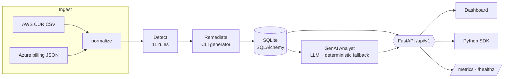

# FinOptic — Cloud Cost Optimizer & Remediation Engine

> Ingest AWS/Azure billing exports → detect orphaned & idle resources → generate the exact CLI/API to
> reclaim the spend → get a GenAI-authored executive runbook. **API-first. Safe by default. Runs fully offline.**

[](https://github.com/shanto12/finoptic/actions/workflows/ci.yml)


FinOptic is a FinOps engine that turns a raw cloud bill into **a prioritized, costed, executable remediation plan**.
On the bundled sample it finds **17 waste items worth $1,095.32/month ($13,143.84/year)** across AWS and Azure — and
for each one it emits the precise `aws`/`az` command to decommission it.

*Built for the GenAI Engineer (FDE) challenge — Project 1. The whole codebase was authored by an AI agent under
architectural direction (see [`prompts.md`](prompts.md)).*

---

## Why this exists

Idle and orphaned cloud resources — unattached disks, stopped-but-billing instances, unassociated IPs, dead load
balancers, ancient snapshots — are the single most common source of silent cloud waste. The signal is already in the
billing export; what teams lack is a fast, safe way to **find it, price it, and act on it**. FinOptic closes that loop.

## What it does

- **Ingest** AWS Cost-and-Usage-Report-style CSV and Azure billing JSON into a normalized model.
- **Detect** 11 categories of waste with a defensive rule engine (one bad row never aborts a scan).
- **Price** every finding (`$/month` and annualized) and roll it up by severity, category, provider, and resource type.
- **Remediate** — generate the exact `aws`/`az` CLI per finding, plus a **DRY-RUN-guarded** bash script you can review and run.
- **Explain** — a GenAI "FinOps analyst" writes an executive summary + a prioritized runbook, grounded in a FinOps
  knowledge base. Works with Anthropic / OpenAI / Azure OpenAI, and **falls back to deterministic output when no key is set**.
- **Serve** it all behind a FastAPI API, a zero-build dashboard, a Python SDK, and a CLI.

## Architecture



The pipeline stages are decoupled by **framework-free domain dataclasses** (`NormalizedRecord` → `FindingResult` →
`RemediationResult`), which is what let the modules be built and tested independently. Swapping SQLite for Postgres is a
one-line config change.

## Quickstart

```bash
# 1. Install (Python 3.10+)
python -m venv .venv && source .venv/bin/activate
pip install -e ".[dev]"

# 2a. Offline CLI demo — scan the bundled sample data
finoptic sample

# 2b. Or run the API + dashboard
uvicorn finoptic.api.app:app --reload
#   → open http://localhost:8000  and click "Load sample data"
```

With Docker:

```bash
docker compose up --build      # → http://localhost:8000
```

End-to-end API tour (server must be running):

```bash
./scripts/demo.sh
```

## GenAI analyst (optional, graceful)

The `/api/v1/analyze` endpoint produces an executive summary + prioritized runbook. It is **off by default and degrades
gracefully** — no key, no network, no problem (you still get a high-quality deterministic runbook). To enable the LLM:

```bash
export ANTHROPIC_API_KEY=sk-...        # auto-detected
# or: export OPENAI_API_KEY / AZURE_OPENAI_API_KEY (+ AZURE_OPENAI_ENDPOINT)
```

Guardrails: provider-agnostic over `httpx` (no vendor SDKs), bounded prompt size, strict timeout, and **every LLM error
is swallowed and falls back to deterministic output** so a model outage can never break the pipeline.

## API reference

| Method | Path | Purpose |
| ------ | ---- | ------- |
| `GET`  | `/healthz` · `/readyz` | Liveness / readiness |
| `GET`  | `/metrics` | Prometheus metrics |
| `POST` | `/api/v1/ingest` | Upload a billing export (`multipart`, field `file`) |
| `POST` | `/api/v1/ingest/sample` | Ingest the bundled AWS+Azure sample |
| `GET`  | `/api/v1/batches` | List ingested batches |
| `GET`  | `/api/v1/summary` | Totals + breakdowns (+ top findings) |
| `GET`  | `/api/v1/findings` | List/filter findings (`severity`, `category`, `provider`, pagination) |
| `GET`  | `/api/v1/findings/{uid}` | Single finding |
| `POST` | `/api/v1/analyze` | GenAI executive summary + runbook |
| `GET`  | `/api/v1/export/remediation.sh` | Download the DRY-RUN-guarded remediation script |

Interactive OpenAPI docs at `/docs`.

## Detection rules

| Rule | Cloud | Resource | Triggers when | Severity |
| ---- | ----- | -------- | ------------- | -------- |
| `AWS_EBS_UNATTACHED` | AWS | EBS volume | `available` (unattached) | high |
| `AWS_EC2_IDLE` | AWS | EC2 instance | running, avg CPU < 5% & low net | high |
| `AWS_EIP_UNASSOCIATED` | AWS | Elastic IP | not associated | medium |
| `AWS_RDS_IDLE` | AWS | RDS instance | 0 connections | high |
| `AWS_ELB_IDLE` | AWS | Load balancer | 0 requests / 0 healthy targets | medium |
| `AWS_SNAPSHOT_STALE` | AWS | Snapshot | age > 90d / source gone | low |
| `AWS_NATGW_IDLE` | AWS | NAT gateway | 0 active connections | medium |
| `AZURE_DISK_UNATTACHED` | Azure | Managed disk | unattached | high |
| `AZURE_PUBLIC_IP_UNASSOCIATED` | Azure | Public IP | not associated | low |
| `AZURE_VM_DEALLOCATED` | Azure | VM | deallocated (disks still billing) | medium |
| `AZURE_SNAPSHOT_STALE` | Azure | Disk snapshot | age > 90d | low |

## Sample results

```
$ finoptic sample
FinOptic scan — 32 resources, 17 findings
[HIGH    ] Idle RDS instance prod-analytics-replica (0 connections)
            $412.00/mo  ($4,944.00/yr)  · AWS_RDS_IDLE
            ↳ aws rds stop-db-instance --db-instance-identifier prod-analytics-replica --region us-east-1
...
Total recoverable: $1,095.32/mo  ($13,143.84/yr)
```

| Breakdown | Value |
| --------- | ----- |
| Total recoverable | **$1,095.32 / month → $13,143.84 / year** |
| By provider | AWS $753.79 · Azure $341.53 |
| By severity | high $762.56 · medium $295.51 · low $37.25 |

## Python SDK

```python
from finoptic.sdk import FinOpticClient

fin = FinOpticClient("http://localhost:8000")
fin.load_sample()
print(fin.summary()["total_monthly_waste"])      # 1095.32
for f in fin.list_findings(severity="high")["items"]:
    print(f["resource_id"], f["remediation"]["cli_commands"][0])
```

## Safety

- The remediation script is **generated, never executed**. It runs in `DRY_RUN=1` mode by default (commands are printed,
  not run); an operator must explicitly `DRY_RUN=0` to act. Every finding carries a **risk rating** and a **reversible** flag.
- FinOptic provisions **no cloud infrastructure** — it reads exported billing data into a local SQLite file — so there is
  nothing to decommission after use and no cloud spend is incurred (satisfying the challenge's responsibility clause).

## Project layout

```
src/finoptic/
  domain.py            # framework-free contract types (the pipeline backbone)
  config.py db.py models.py schemas.py logging_config.py
  ingest/              # AWS CUR + Azure billing parsers
  detect/              # 11-rule waste engine + summarize()
  remediate/           # aws/az CLI generator + DRY-RUN script renderer
  analyze/             # LLM client + FinOps KB + analyst (deterministic fallback)
  api/                 # FastAPI app, routes, auth, rate-limit, middleware
  observability/       # Prometheus metrics
  dashboard/           # zero-build SPA (vanilla JS + Chart.js)
  sdk/                 # typed Python client
  cli.py               # scan / sample / serve
sample_data/           # realistic AWS+Azure exports + expected results
tests/                 # 50 tests (unit, API contract, live-server SDK, CLI, security hardening)
```

## Testing & quality

```bash
make test     # 50 passing
make cov      # coverage (86%)
make lint     # ruff
```

The suite includes an adversarial multi-agent review pass; see [`docs/REVIEW.md`](docs/REVIEW.md) for the
findings that were confirmed and fixed (cross-batch leak guard, shell/prompt-injection hardening, bounded
metric cardinality, rate-limiter memory bounds, and cloud-domain remediation correctness).

CI runs ruff + format-check + the full suite on Python 3.11 and 3.12 (`.github/workflows/ci.yml`).

## Configuration

All env vars are optional (prefix `FINOPTIC_`); see [`.env.example`](.env.example). Highlights: `DATABASE_URL`
(swap to Postgres), `REQUIRE_AUTH` + `API_KEYS` (X-API-Key), `RATE_LIMIT_PER_MINUTE`, and the `LLM_*` / provider keys.

## How this maps to the role

Python + **FastAPI** (contract-first, OpenAPI, auth, rate limiting, observability) · **GenAI** (LLM integration, RAG-style
KB grounding, evaluation-minded guardrails, graceful degradation) · **SDK** design + packaging · **cloud/FinOps** domain ·
**CI/CD**, Docker, pytest, ruff · safe, ownership-driven, ship-fast execution.

## License

MIT — see [`LICENSE`](LICENSE).
